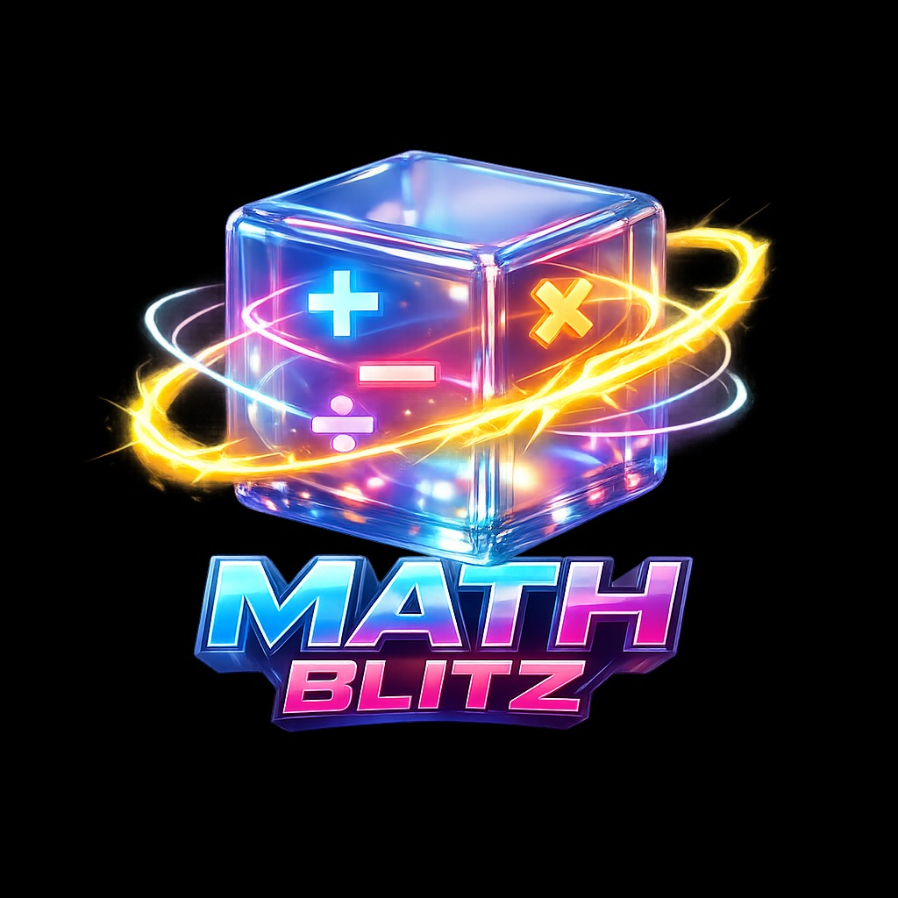

# Math Blitz ⚡

A fast-paced, interactive math puzzle game built with modern web technologies. Race against the clock to solve arithmetic problems and set a new high score!



## 🚀 Features

-   **Dynamic Gameplay**: Infinite procedurally generated questions with three difficulty levels (Easy, Medium, Hard).
-   **Combo System**: Build streaks to maximize your score with multiplier bonuses.
-   **Premium UI**: A polished interface featuring Glassmorphism, neon gradients, and fluid animations.
-   **Audio Feedback**: Custom synthesized sound effects (Web Audio API) for interactions, success, and failure conditions.
-   **Input Versatility**:
    -   **Virtual Keypad**: Large, touch-friendly buttons.
    -   **Physical Keyboard**: Full support for Numpad, Digits, Backspace, and Enter keys.
-   **Responsive Design**: Fully optimized for diverse screen sizes, from mobile phones to high-res desktops.

## 🛠️ Tech Stack

-   **Language**: TypeScript
-   **Build Tool**: Vite
-   **Styling**: Pure CSS3 (CSS Variables, Flexbox, Grid, Backdrop Filters)
-   **State Management**: Custom Flux-inspired Store
-   **Audio**: Native Web Audio API (No external assets required)

## 🏁 Getting Started

### Prerequisites

-   Node.js (v16 or higher)
-   npm (v7 or higher)

### Installation

1.  **Clone the repository**
    ```bash
    git clone https://github.com/wex-ocean/math-game.git
    cd math-game
    ```

2.  **Install dependencies**
    ```bash
    npm install
    ```

3.  **Start the development server**
    ```bash
    npm run dev
    ```

4.  **Build for production**
    ```bash
    npm run build
    ```

## 🎮 How to Play

1.  **Choose Your Challenge**: Select a difficulty level (Medium is default).
2.  **Start**: Click **Start Game** to begin the 60-second timer.
3.  **Solve**: Calculate the answer to the displayed math problem.
    -   Type using your keyboard or the on-screen keypad.
    -   Use `Backspace` or `C` to correct mistakes.
4.  **Submit**: Press `Enter` or click **Submit Answer**.
5.  **Score**: 
    -   **Correct**: Earn points based on difficulty + Streak Bonus.
    -   **Wrong**: Streak resets to zero. Time penalty applied (visual feedback).

## 📂 Project Structure

```
math-game/
├── src/
│   ├── core/           # Game logic (Timer, Scoring, Generators)
│   ├── state/          # State management (Store, Actions)
│   ├── ui/             # UI Components and Screen Managers
│   └── assets/         # Global styles and themes
├── public/             # Static assets (Logo, Favicon)
└── index.html          # Entry point
```

## 📄 License

This project is open source and available under the [MIT License](LICENSE).

---
*Built with ❤️ for Math Lovers.*
